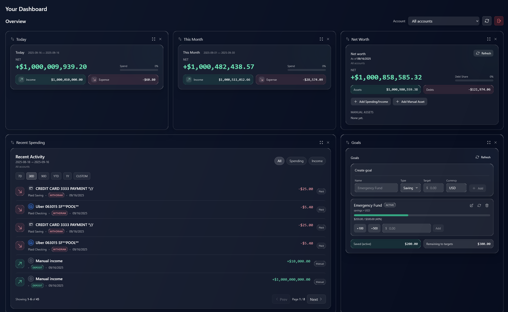

# Finance Dashboard — Premium Widgets

High-signal, low-noise widgets with a clean glassmorphism aesthetic:

- **Income vs Expense** — gradient line chart, subtle fills, premium tooltip, tight typography.
- **Category Pie** — Spending/Income modes, icon-only chips, compact center KPI ribbon, segmented toggles.
- TZ-safe date utilities, defensive number parsing, and flexible mappers for varied backend payloads.

<div align="center">





</div>

> **Screenshot locations**
>
> ```
> docs/images/income-expense.png
> docs/images/category-pie-spending.png
> docs/images/category-pie-income.png
> ```
> Add more (mobile/desktop, dark/light) if you like — the layout is responsive.

---

## Table of Contents

- [Highlights](#highlights)
- [Widgets](#widgets)
  - [IncomeExpenseChartWidget](#incomeexpensechartwidget)
  - [CategoryPieWidget](#categorypiewidget)
- [Data & API Contracts](#data--api-contracts)
- [Time-Zone Safety](#time-zone-safety)
- [Install & Run](#install--run)
- [Styling & Theming](#styling--theming)
- [Performance Notes](#performance-notes)
- [Troubleshooting](#troubleshooting)
- [Changelog](#changelog)

---

## Highlights

- **Premium but quiet**: glass surfaces, soft rings, finely tuned spacing. No heavy glows or cartoonish colors.
- **Gradient lines**: dynamic stroke gradients that fit the chart area; calm area fills for depth.
- **Segmented toggles**: rounded, animated (Framer Motion spring) thumb; accessible and compact.
- **Icon chips**: category chips show only icons + %; clean and scannable. Tap to filter the transactions list.
- **Compact KPI ribbon** in the donut center: responsive `clamp()` sizing, `tabular-nums`, tight tracking.
- **TZ-safe queries**: local YMD → UTC ISO with exclusive end, so no off-by-one surprises.
- **Defensive parsing**: tolerant of payloads with `spend`, `expense`, `amount`, etc. No `NaN` leaks.

---

## Widgets

### `IncomeExpenseChartWidget`

**What it shows**
- Income vs Expense over time with gradient strokes + soft fills.
- Filters: **Granularity** (day/month/year), **Presets** (7/30/90/YTD/1Y/All), series toggles.
- Optional insights (top categories, merchants, largest expenses, burn-rate) if routes are wired.

**UX details**
- Tooltips are minimal: currency only, no color blocks.
- Lines are 2px with gentle tension (`0.15`) for a modern “system charts” look.
- Labels are drawn from backend `period` (`YYYY-MM-DD` or `YYYY-MM`); we don’t “format fight” them.

**Screenshot**


---

### `CategoryPieWidget`

**What it shows**
- A donut pie with mode toggle: **Spending** or **Income**.
- Presets: 30D / 90D / YTD / 1Y.
- A **center KPI ribbon** (Total Spending/Income) using responsive `clamp()` and `tabular-nums`.
- **Icon-only chips** for categories with subtle elevation on hover. Clicking a slice/chip fires a
  `ui:transactions:filter` event (category + date range + type), which your transactions view can listen to.

**Why it feels premium**
- Minimal halo on active slice; subtle ring, no loud glow.
- Chips are tactile, with a quiet ring and slight lift — not flashy.
- Typography is tight and legible; no heavy weights, just enough contrast.

**Screenshots**


---

## Data & API Contracts

These widgets are built to tolerate slightly different shapes from your backend by using **defensive mappers**.

### Endpoints used

#### `GET /api/transactions/summary`
**Query**
- `granularity=day|month|year`
- `startDate=<UTC ISO inclusive>`
- `endDate=<UTC ISO exclusive>`
- optional: `accountId`, `accountIds`

**Response**
```json
{
  "granularity": "month",
  "data": [
    { "period": "2025-01", "income": 1234.56, "expense": 789.00, "net": 445.56 }
  ]
}
